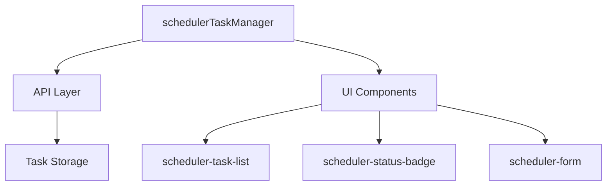

# Task Scheduler Feature Design

## Overview

The Task Scheduler is a dedicated system for managing scheduled and ad-hoc tasks within the application. It operates independently from other task systems and maintains its own state, storage, and UI components.

## ⚠️ CRITICAL: NAMING CONVENTION ⚠️

All components of the Task Scheduler MUST follow the `scheduler-` prefix naming convention to maintain clear separation from other task-related features.

### Naming Requirements

1. **Component Names**:
   ```javascript
   // JavaScript components
   Alpine.data('schedulerTaskManager', () => ({...}))
   Alpine.data('schedulerTaskForm', () => ({...}))

   // CSS classes
   .scheduler-task-list
   .scheduler-task-item
   .scheduler-status-badge

   // API endpoints
   /scheduler_tasks_list
   /scheduler_task_create
   ```

2. **Method Names**:
   ```javascript
   // Task management methods
   loadSchedulerTasks()
   saveSchedulerTask()
   toggleSchedulerTaskState()
   deleteSchedulerTask()
   ```

3. **Storage Keys**:
   ```javascript
   localStorage.setItem('lastSelectedSchedulerTask', uuid)
   localStorage.setItem('activeTab', 'scheduler-tasks')
   ```

## Architecture

### Component Structure

```
scheduler/
├── components/
│   ├── SchedulerTaskManager.js    # Main task management component
│   ├── SchedulerTaskForm.js       # Task creation/editing form
│   └── SchedulerStatusBadge.js    # Task status indicator
├── styles/
│   └── scheduler.css              # Scheduler-specific styles
└── api/
    └── scheduler_endpoints.py      # API endpoints
```

### Data Flow



## Component Specifications

### 1. Task Manager Component

```javascript
Alpine.data('schedulerTaskManager', () => ({
    tasks: [],
    selected: '',
    isLoading: true,

    async loadSchedulerTasks() {
        // Implementation
    },

    async saveSchedulerTask() {
        // Implementation
    }
}));
```

### 2. Task List Component

```html
<div class="scheduler-task-list">
    <template x-for="task in filteredSchedulerTasks">
        <div class="scheduler-task-item">
            <!-- Task item content -->
        </div>
    </template>
</div>
```

### 3. Status Badge Component

```html
<div class="scheduler-status-badge" :class="getSchedulerStatusClass(task)">
    <span x-text="getSchedulerStatusLabel(task)"></span>
</div>
```

## API Endpoints

1. **List Tasks**
   ```
   GET /scheduler_tasks_list
   Response: { tasks: [...] }
   ```

2. **Create Task**
   ```
   POST /scheduler_task_create
   Body: { name, type, schedule?, token? }
   ```

3. **Update Task**
   ```
   POST /scheduler_task_update
   Body: { uuid, ...updates }
   ```

4. **Delete Task**
   ```
   POST /scheduler_task_delete
   Body: { uuid }
   ```

## State Management

### Local Storage

```javascript
// Task selection
localStorage.setItem('lastSelectedSchedulerTask', uuid)
localStorage.setItem('activeTab', 'scheduler-tasks')

// Task state
localStorage.setItem('schedulerTaskFilter', filter)
localStorage.setItem('schedulerTaskSort', sort)
```

### Component State

```javascript
{
    tasks: [],              // List of scheduler tasks
    selected: '',          // Selected task UUID
    isLoading: true,      // Loading state
    filterType: 'all',    // Task type filter
    filterStatus: 'all',  // Status filter
    sortBy: 'name',      // Sort field
    sortOrder: 'asc'     // Sort direction
}
```

## UI/UX Design

### Task List Layout

```css
.scheduler-task-list {
    display: flex;
    flex-direction: column;
    gap: 8px;
}

.scheduler-task-item {
    display: grid;
    grid-template-columns: auto 1fr auto;
    align-items: center;
    padding: 12px;
}
```

### Status Badge Styles

```css
.scheduler-status-badge {
    padding: 4px 8px;
    border-radius: 4px;
    font-size: 12px;
    font-weight: 500;
}

.scheduler-status-idle { background: var(--blue-50); }
.scheduler-status-running { background: var(--green-50); }
.scheduler-status-disabled { background: var(--gray-50); }
.scheduler-status-error { background: var(--red-50); }
```

## Testing Strategy

### Unit Tests

1. **Component Tests**
   - Test scheduler-specific functionality
   - Verify proper prefix usage
   - Check state management

2. **API Tests**
   - Test endpoint functionality
   - Verify error handling
   - Check response formats

### Integration Tests

1. **Component Integration**
   - Test interaction between components
   - Verify state propagation
   - Check event handling

2. **System Integration**
   - Test scheduler isolation
   - Verify no interference
   - Check storage separation

### UI Tests

1. **Visual Tests**
   - Verify styling consistency
   - Check responsive design
   - Validate accessibility

2. **Interaction Tests**
   - Test user workflows
   - Check error handling
   - Verify state updates

## Implementation Checklist

### Phase 1: Core Components
- [x] Create schedulerTaskManager component
- [x] Implement basic task list
- [x] Add status badge component
- [x] Set up API endpoints

### Phase 2: UI Enhancement
- [x] Style task list items
- [x] Add status badge styles
- [x] Implement responsive design
- [x] Add loading states

### Phase 3: Features
- [x] Add task filtering
- [x] Implement sorting
- [x] Add task validation
- [x] Implement error handling

### Phase 4: Testing
- [ ] Write unit tests
- [ ] Add integration tests
- [ ] Perform UI testing
- [ ] Document test cases

## Future Enhancements

1. **Advanced Filtering**
   - Multiple status filters
   - Custom filter combinations
   - Saved filter presets

2. **Task Templates**
   - Predefined task templates
   - Custom template creation
   - Template management

3. **Batch Operations**
   - Multi-task selection
   - Bulk status updates
   - Batch deletion

## Documentation Requirements

1. **Component Documentation**
   - Document naming convention
   - Explain component structure
   - Detail state management

2. **API Documentation**
   - Document endpoints
   - Describe request/response
   - List error codes

3. **Testing Documentation**
   - Document test cases
   - Explain test coverage
   - List known issues

## Security Considerations

1. **Access Control**
   - Role-based access
   - Action permissions
   - Audit logging

2. **Data Validation**
   - Input sanitization
   - Type checking
   - Format validation

3. **Error Handling**
   - Secure error messages
   - Logging strategy
   - Recovery procedures
